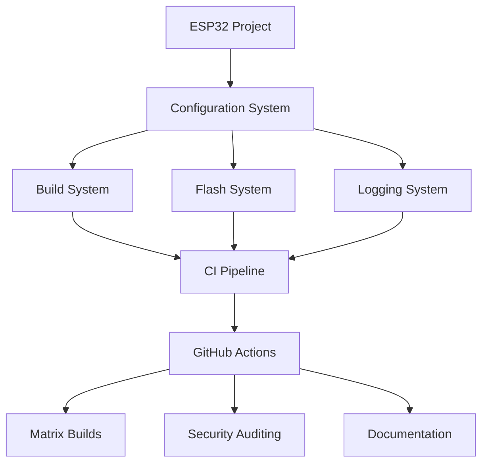

# 🔧 HardFOC ESP32 CI Tools

Advanced CI/CD Tools for HardFOC ESP32 Projects - Comprehensive GitHub Actions workflows for ESP-IDF development with matrix builds, security auditing, and automated documentation.

## 🚀 Quick Start

Get up and running with the HardFOC ESP32 CI Tools in minutes:

1. **Clone the repository** and navigate to your ESP32 project
2. **Copy the workflow files** to your `.github/workflows/` directory
3. **Configure your project** using the provided configuration templates
4. **Push to GitHub** and watch your CI pipeline automatically build and test your ESP32 applications

## 📚 Documentation

Explore our comprehensive documentation to understand all features and capabilities:

- **[Getting Started](getting-started/)** - Quick setup and basic usage
- **[Build System](build-system/)** - ESP-IDF build management and optimization
- **[CI Pipeline](ci-pipeline/)** - GitHub Actions workflows and automation
- **[Configuration](configuration/)** - Centralized configuration management
- **[Advanced Topics](advanced/)** - Multi-version support, logging, and utilities

## ✨ Key Features

- **🔧 Matrix Builds**: Parallel building across multiple ESP-IDF versions and build types
- **🛡️ Security Auditing**: Comprehensive dependency scanning and vulnerability detection
- **📊 Performance Optimization**: Intelligent caching and build acceleration
- **🌍 Cross-Platform**: Support for Linux, macOS, and Windows (WSL2)
- **📝 Automated Documentation**: Self-updating documentation with Jekyll/Just the Docs
- **🔍 Port Detection**: Intelligent ESP32 device identification and troubleshooting
- **📋 Logging System**: Comprehensive logging with search and analysis capabilities

## 🏗️ Architecture

The HardFOC ESP32 CI Tools provide a complete development ecosystem:

## 🎯 Use Cases

Perfect for:
- **ESP32 Development Teams** - Streamlined CI/CD workflows
- **Open Source Projects** - Automated testing and documentation
- **Professional Development** - Enterprise-grade build and deployment pipelines
- **Educational Projects** - Learning ESP32 development with modern tools

## 📖 Learn More

- **[Features](features/)** - Detailed feature overview
- **[Examples](examples/)** - Real-world usage examples
- **[Troubleshooting](troubleshooting/)** - Common issues and solutions
- **[Contributing](contributing/)** - How to contribute to the project

---

**Ready to get started?** Check out our [Getting Started Guide](getting-started/) or explore the [Build System Documentation](build-system/) for detailed setup instructions.
